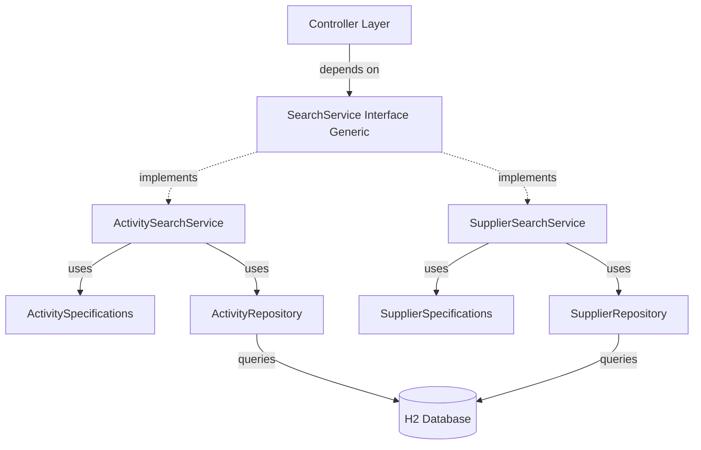

# Search by Params API - Interview Optimized Implementation Guide

This is the **streamlined, time-efficient** approach optimized for coding interviews. It demonstrates advanced design principles while minimizing the number of files and directories created.

---

## Why This Approach is Superior for Interviews

### Demonstrates Advanced Concepts:
- ✅ **Generic Interface Design** - Shows understanding of type parameters
- ✅ **Strategy Pattern** - Explicit strategy implementations  
- ✅ **Dependency Inversion Principle** - Controllers depend on abstractions
- ✅ **Interface Segregation Principle** - Focused, single-purpose interface
- ✅ **Specification Pattern** - Dynamic, composable queries
- ✅ **No Code Duplication** - Inline mapping methods, reusable specifications
- ✅ **Minimal Directory Creation** - Only 2 new directories
- ✅ **Realistic Trade-offs** - Shows judgment (separate mappers = overkill for interview)

### Time-Efficient:
- **30-35 minutes** total implementation time
- Focus on the most impressive patterns (Generic Interface + Specification)
- No over-engineering with excessive mapper classes

---

## Architecture Overview

```
src/main/java/com/getourguide/interview/
├── dto/
│   ├── ActivityDto.java                     [EXISTS]
│   ├── SupplierDto.java                     [NEW - 15 lines]
│   ├── ActivitySearchCriteria.java          [NEW - 40 lines]
│   └── SupplierSearchCriteria.java          [NEW - 30 lines]
│
├── service/
│   └── search/                              [NEW DIRECTORY ⭐]
│       ├── SearchService.java               [NEW - Generic Interface]
│       ├── ActivitySearchService.java       [NEW - Implementation]
│       └── SupplierSearchService.java       [NEW - Implementation]
│
├── specification/                           [NEW DIRECTORY ⭐]
│   ├── ActivitySpecifications.java          [NEW - Core pattern]
│   └── SupplierSpecifications.java          [NEW - Core pattern]
│
├── repository/
│   ├── ActivityRepository.java              [MODIFY - 1 line change]
│   └── SupplierRepository.java              [MODIFY - 1 line change]
│
└── controller/
    ├── ActivitiesController.java            [MODIFY - add endpoint]
    └── SupplierController.java              [MODIFY - add endpoint]
```

**Total New Directories: 2**  
**Total New Files: 8**  
**Modified Files: 4**

---

## Component Dependency Flow



---

## Implementation Steps

### Step 1: Create Search Criteria DTOs (5 minutes)

#### 1.1 Create `ActivitySearchCriteria.java`

**Location**: `src/main/java/com/getourguide/interview/dto/ActivitySearchCriteria.java`

```java
package com.getourguide.interview.dto;

import lombok.AllArgsConstructor;
import lombok.Builder;
import lombok.Data;
import lombok.NoArgsConstructor;

@Data
@Builder
@NoArgsConstructor
@AllArgsConstructor
public class ActivitySearchCriteria {
    private String title;              // partial match, case-insensitive
    private Integer minPrice;          // >= minPrice
    private Integer maxPrice;          // <= maxPrice
    private Double minRating;          // >= minRating
    private String currency;           // exact match, case-insensitive
    private Boolean specialOffer;      // true/false/null
    private String supplierName;       // partial match on supplier.name
}
```

#### 1.2 Create `SupplierSearchCriteria.java`

**Location**: `src/main/java/com/getourguide/interview/dto/SupplierSearchCriteria.java`

```java
package com.getourguide.interview.dto;

import lombok.AllArgsConstructor;
import lombok.Builder;
import lombok.Data;
import lombok.NoArgsConstructor;

@Data
@Builder
@NoArgsConstructor
@AllArgsConstructor
public class SupplierSearchCriteria {
    private String name;       // partial match, case-insensitive
    private String address;    // partial match, case-insensitive
    private String zip;        // exact match
    private String city;       // partial match, case-insensitive
    private String country;    // partial match, case-insensitive
}
```

#### 1.3 Create `SupplierDto.java` (if doesn't exist)

**Location**: `src/main/java/com/getourguide/interview/dto/SupplierDto.java`

```java
package com.getourguide.interview.dto;

import lombok.AllArgsConstructor;
import lombok.Builder;
import lombok.Data;
import lombok.NoArgsConstructor;

@Data
@Builder
@NoArgsConstructor
@AllArgsConstructor
public class SupplierDto {
    private Long id;
    private String name;
    private String address;
    private String zip;
    private String city;
    private String country;
}
```

---

### Step 2: Create Generic SearchService Interface (3 minutes)

**Location**: `src/main/java/com/getourguide/interview/service/search/SearchService.java`

```java
package com.getourguide.interview.service.search;

import java.util.List;

/**
 * Generic search service interface for searchable entities.
 * 
 * Type Parameters:
 *   ENTITY - The JPA entity type (e.g., Activity, Supplier)
 *   DTO - The data transfer object returned to API clients
 *   CRITERIA - The search criteria object containing filter parameters
 * 
 * This interface demonstrates:
 * - Interface Segregation Principle (small, focused contract)
 * - Dependency Inversion Principle (depend on abstraction)
 * - Strategy Pattern (multiple implementations for different entities)
 */
public interface SearchService<ENTITY, DTO, CRITERIA> {
    
    /**
     * Search entities based on flexible criteria
     * All criteria fields are optional (null = ignore)
     * 
     * @param criteria Search parameters
     * @return List of DTOs matching criteria (empty list if none found)
     */
    List<DTO> search(CRITERIA criteria);
    
    /**
     * Find entity by ID
     * 
     * @param id Entity identifier
     * @return DTO representation of entity
     * @throws RuntimeException if entity not found
     */
    DTO findById(Long id);
    
    /**
     * Find all entities (no filtering)
     * 
     * @return List of all entities as DTOs
     */
    List<DTO> findAll();
}
```

**Interview Talking Point:**
> "I created a generic interface with three type parameters. This demonstrates the Interface Segregation Principle - a small, focused contract that any searchable entity can implement. Controllers depend on this abstraction, not concrete implementations, which is the Dependency Inversion Principle."

---

### Step 3: Create Specifications (15 minutes)

#### 3.1 Create `ActivitySpecifications.java`

**Location**: `src/main/java/com/getourguide/interview/specification/ActivitySpecifications.java`

```java
package com.getourguide.interview.specification;

import com.getourguide.interview.dto.ActivitySearchCriteria;
import com.getourguide.interview.entity.Activity;
import com.getourguide.interview.entity.Supplier;
import jakarta.persistence.criteria.Join;
import jakarta.persistence.criteria.JoinType;
import org.springframework.data.jpa.domain.Specification;

/**
 * JPA Specifications for Activity entity.
 * Each method returns a reusable, composable Specification.
 * 
 * Demonstrates:
 * - Specification Pattern for dynamic query building
 * - Open/Closed Principle (add criteria without modifying existing code)
 * - Single Responsibility Principle (each method handles one criterion)
 */
public class ActivitySpecifications {
    
    /**
     * Filter by title (partial match, case-insensitive)
     */
    public static Specification<Activity> hasTitle(String title) {
        return (root, query, cb) -> {
            if (title == null || title.trim().isEmpty()) {
                return null;
            }
            return cb.like(
                cb.lower(root.get("title")),
                "%" + title.toLowerCase().trim() + "%"
            );
        };
    }
    
    /**
     * Filter by price range
     */
    public static Specification<Activity> hasPriceRange(Integer minPrice, Integer maxPrice) {
        return (root, query, cb) -> {
            if (minPrice == null && maxPrice == null) {
                return null;
            }
            if (minPrice != null && maxPrice != null) {
                return cb.between(root.get("price"), minPrice, maxPrice);
            }
            if (minPrice != null) {
                return cb.greaterThanOrEqualTo(root.get("price"), minPrice);
            }
            return cb.lessThanOrEqualTo(root.get("price"), maxPrice);
        };
    }
    
    /**
     * Filter by minimum rating
     */
    public static Specification<Activity> hasMinRating(Double minRating) {
        return (root, query, cb) -> {
            if (minRating == null) {
                return null;
            }
            return cb.greaterThanOrEqualTo(root.get("rating"), minRating);
        };
    }
    
    /**
     * Filter by currency (exact match, case-insensitive)
     */
    public static Specification<Activity> hasCurrency(String currency) {
        return (root, query, cb) -> {
            if (currency == null || currency.trim().isEmpty()) {
                return null;
            }
            return cb.equal(
                cb.lower(root.get("currency")),
                currency.toLowerCase().trim()
            );
        };
    }
    
    /**
     * Filter by special offer flag
     */
    public static Specification<Activity> hasSpecialOffer(Boolean specialOffer) {
        return (root, query, cb) -> {
            if (specialOffer == null) {
                return null;
            }
            return cb.equal(root.get("specialOffer"), specialOffer);
        };
    }
    
    /**
     * Filter by supplier name (requires JOIN)
     * This demonstrates relationship traversal in specifications
     */
    public static Specification<Activity> hasSupplierName(String supplierName) {
        return (root, query, cb) -> {
            if (supplierName == null || supplierName.trim().isEmpty()) {
                return null;
            }
            Join<Activity, Supplier> supplierJoin = root.join("supplier", JoinType.LEFT);
            return cb.like(
                cb.lower(supplierJoin.get("name")),
                "%" + supplierName.toLowerCase().trim() + "%"
            );
        };
    }
    
    /**
     * Combine all criteria from SearchCriteria object
     * This is the main entry point used by the service
     */
    public static Specification<Activity> fromCriteria(ActivitySearchCriteria criteria) {
        return Specification
                .where(hasTitle(criteria.getTitle()))
                .and(hasPriceRange(criteria.getMinPrice(), criteria.getMaxPrice()))
                .and(hasMinRating(criteria.getMinRating()))
                .and(hasCurrency(criteria.getCurrency()))
                .and(hasSpecialOffer(criteria.getSpecialOffer()))
                .and(hasSupplierName(criteria.getSupplierName()));
    }
}
```

#### 3.2 Create `SupplierSpecifications.java`

**Location**: `src/main/java/com/getourguide/interview/specification/SupplierSpecifications.java`

```java
package com.getourguide.interview.specification;

import com.getourguide.interview.dto.SupplierSearchCriteria;
import com.getourguide.interview.entity.Supplier;
import org.springframework.data.jpa.domain.Specification;

public class SupplierSpecifications {
    
    public static Specification<Supplier> hasName(String name) {
        return (root, query, cb) -> {
            if (name == null || name.trim().isEmpty()) {
                return null;
            }
            return cb.like(
                cb.lower(root.get("name")),
                "%" + name.toLowerCase().trim() + "%"
            );
        };
    }
    
    public static Specification<Supplier> hasAddress(String address) {
        return (root, query, cb) -> {
            if (address == null || address.trim().isEmpty()) {
                return null;
            }
            return cb.like(
                cb.lower(root.get("address")),
                "%" + address.toLowerCase().trim() + "%"
            );
        };
    }
    
    public static Specification<Supplier> hasZip(String zip) {
        return (root, query, cb) -> {
            if (zip == null || zip.trim().isEmpty()) {
                return null;
            }
            return cb.equal(root.get("zip"), zip.trim());
        };
    }
    
    public static Specification<Supplier> hasCity(String city) {
        return (root, query, cb) -> {
            if (city == null || city.trim().isEmpty()) {
                return null;
            }
            return cb.like(
                cb.lower(root.get("city")),
                "%" + city.toLowerCase().trim() + "%"
            );
        };
    }
    
    public static Specification<Supplier> hasCountry(String country) {
        return (root, query, cb) -> {
            if (country == null || country.trim().isEmpty()) {
                return null;
            }
            return cb.like(
                cb.lower(root.get("country")),
                "%" + country.toLowerCase().trim() + "%"
            );
        };
    }
    
    public static Specification<Supplier> fromCriteria(SupplierSearchCriteria criteria) {
        return Specification
                .where(hasName(criteria.getName()))
                .and(hasAddress(criteria.getAddress()))
                .and(hasZip(criteria.getZip()))
                .and(hasCity(criteria.getCity()))
                .and(hasCountry(criteria.getCountry()));
    }
}
```

**Key Understanding:**
- Lambda syntax: `(root, query, cb) -> ...`
  - `root` = the entity being queried
  - `query` = the CriteriaQuery being built
  - `cb` = CriteriaBuilder for creating predicates
- Returning `null` means "don't apply this filter"
- Specifications are composable with `.and()` and `.or()`

---

### Step 4: Enhance Repositories (1 minute)

#### 4.1 Modify `ActivityRepository.java`

**Location**: `src/main/java/com/getourguide/interview/repository/ActivityRepository.java`

**Change this:**
```java
public interface ActivityRepository extends JpaRepository<Activity, Long> {
}
```

**To this:**
```java
public interface ActivityRepository extends 
        JpaRepository<Activity, Long>, 
        JpaSpecificationExecutor<Activity> {
}
```

#### 4.2 Create/Modify `SupplierRepository.java`

**Location**: `src/main/java/com/getourguide/interview/repository/SupplierRepository.java`

```java
package com.getourguide.interview.repository;

import com.getourguide.interview.entity.Supplier;
import org.springframework.data.jpa.repository.JpaRepository;
import org.springframework.data.jpa.repository.JpaSpecificationExecutor;
import org.springframework.stereotype.Repository;

@Repository
public interface SupplierRepository extends 
        JpaRepository<Supplier, Long>, 
        JpaSpecificationExecutor<Supplier> {
}
```

**What this does:**
- Adds `findAll(Specification<T> spec)` method automatically
- No implementation needed - Spring provides it!

---

### Step 5: Create Search Service Implementations (12 minutes)

#### 5.1 Create `ActivitySearchService.java`

**Location**: `src/main/java/com/getourguide/interview/service/search/ActivitySearchService.java`

```java
package com.getourguide.interview.service.search;

import com.getourguide.interview.dto.ActivityDto;
import com.getourguide.interview.dto.ActivitySearchCriteria;
import com.getourguide.interview.entity.Activity;
import com.getourguide.interview.repository.ActivityRepository;
import com.getourguide.interview.specification.ActivitySpecifications;
import lombok.AllArgsConstructor;
import org.springframework.data.jpa.domain.Specification;
import org.springframework.stereotype.Service;

import java.util.List;
import java.util.stream.Collectors;

/**
 * Search service implementation for Activity entity.
 * Implements SearchService with specific types.
 * 
 * Responsibilities:
 * - Build specifications from criteria
 * - Execute queries via repository
 * - Map entities to DTOs
 */
@Service
@AllArgsConstructor
public class ActivitySearchService implements SearchService<Activity, ActivityDto, ActivitySearchCriteria> {
    
    private final ActivityRepository activityRepository;
    
    @Override
    public List<ActivityDto> search(ActivitySearchCriteria criteria) {
        // Build specification from criteria
        Specification<Activity> spec = ActivitySpecifications.fromCriteria(criteria);
        
        // Execute query (database-level filtering)
        List<Activity> activities = activityRepository.findAll(spec);
        
        // Map to DTOs
        return mapToDtoList(activities);
    }
    
    @Override
    public ActivityDto findById(Long id) {
        Activity activity = activityRepository.findById(id)
                .orElseThrow(() -> new RuntimeException("Activity not found with id: " + id));
        return mapToDto(activity);
    }
    
    @Override
    public List<ActivityDto> findAll() {
        List<Activity> activities = activityRepository.findAll();
        return mapToDtoList(activities);
    }
    
    /**
     * Map single Activity entity to DTO
     * Private helper - keeps mapping logic in one place
     */
    private ActivityDto mapToDto(Activity activity) {
        return ActivityDto.builder()
                .id(activity.getId())
                .title(activity.getTitle())
                .price(activity.getPrice())
                .currency(activity.getCurrency())
                .rating(activity.getRating())
                .specialOffer(activity.isSpecialOffer())
                .supplierName(activity.getSupplier() != null ? activity.getSupplier().getName() : "")
                .build();
    }
    
    /**
     * Map list of entities to DTOs
     */
    private List<ActivityDto> mapToDtoList(List<Activity> activities) {
        return activities.stream()
                .map(this::mapToDto)
                .collect(Collectors.toList());
    }
}
```

**Why inline mapping is acceptable here:**
- Single responsibility: This class handles Activity search + mapping
- No duplication: One method, reused 3 times
- Interview context: Shows good judgment about trade-offs
- Could easily extract to separate mapper if needed in production

#### 5.2 Create `SupplierSearchService.java`

**Location**: `src/main/java/com/getourguide/interview/service/search/SupplierSearchService.java`

```java
package com.getourguide.interview.service.search;

import com.getourguide.interview.dto.SupplierDto;
import com.getourguide.interview.dto.SupplierSearchCriteria;
import com.getourguide.interview.entity.Supplier;
import com.getourguide.interview.repository.SupplierRepository;
import com.getourguide.interview.specification.SupplierSpecifications;
import lombok.AllArgsConstructor;
import org.springframework.data.jpa.domain.Specification;
import org.springframework.stereotype.Service;

import java.util.List;
import java.util.stream.Collectors;

@Service
@AllArgsConstructor
public class SupplierSearchService implements SearchService<Supplier, SupplierDto, SupplierSearchCriteria> {
    
    private final SupplierRepository supplierRepository;
    
    @Override
    public List<SupplierDto> search(SupplierSearchCriteria criteria) {
        Specification<Supplier> spec = SupplierSpecifications.fromCriteria(criteria);
        List<Supplier> suppliers = supplierRepository.findAll(spec);
        return mapToDtoList(suppliers);
    }
    
    @Override
    public SupplierDto findById(Long id) {
        Supplier supplier = supplierRepository.findById(id)
                .orElseThrow(() -> new RuntimeException("Supplier not found with id: " + id));
        return mapToDto(supplier);
    }
    
    @Override
    public List<SupplierDto> findAll() {
        List<Supplier> suppliers = supplierRepository.findAll();
        return mapToDtoList(suppliers);
    }
    
    private SupplierDto mapToDto(Supplier supplier) {
        return SupplierDto.builder()
                .id(supplier.getId())
                .name(supplier.getName())
                .address(supplier.getAddress())
                .zip(supplier.getZip())
                .city(supplier.getCity())
                .country(supplier.getCountry())
                .build();
    }
    
    private List<SupplierDto> mapToDtoList(List<Supplier> suppliers) {
        return suppliers.stream()
                .map(this::mapToDto)
                .collect(Collectors.toList());
    }
}
```

**Pattern Recognition:**
Notice the structural similarity between ActivitySearchService and SupplierSearchService. This consistency makes the codebase predictable and maintainable.

---

### Step 6: Update Controllers (5 minutes)

#### 6.1 Update `ActivitiesController.java`

**Location**: `src/main/java/com/getourguide/interview/controller/ActivitiesController.java`

```java
package com.getourguide.interview.controller;

import com.getourguide.interview.dto.ActivityDto;
import com.getourguide.interview.dto.ActivitySearchCriteria;
import com.getourguide.interview.entity.Activity;
import com.getourguide.interview.service.search.SearchService;
import lombok.AllArgsConstructor;
import org.springframework.beans.factory.annotation.Qualifier;
import org.springframework.http.ResponseEntity;
import org.springframework.stereotype.Controller;
import org.springframework.web.bind.annotation.GetMapping;
import org.springframework.web.bind.annotation.PathVariable;
import org.springframework.web.bind.annotation.RequestParam;

import java.util.List;

@Controller
@AllArgsConstructor
public class ActivitiesController {

    // Inject the generic interface - demonstrates Dependency Inversion
    @Qualifier("activitySearchService")
    private final SearchService<Activity, ActivityDto, ActivitySearchCriteria> searchService;

    /**
     * Get all activities
     * GET /activities
     */
    @GetMapping("/activities")
    public ResponseEntity<List<ActivityDto>> getAllActivities() {
        return ResponseEntity.ok(searchService.findAll());
    }

    /**
     * Get activity by ID
     * GET /activities/{id}
     */
    @GetMapping("/activities/{id}")
    public ResponseEntity<ActivityDto> getActivity(@PathVariable Long id) {
        return ResponseEntity.ok(searchService.findById(id));
    }

    /**
     * Search activities with query parameters
     * GET /activities/search?title=X&minPrice=Y&maxPrice=Z&minRating=R&currency=C&specialOffer=true&supplierName=S
     * 
     * Example requests:
     * - /activities/search?title=museum
     * - /activities/search?minPrice=50&maxPrice=200
     * - /activities/search?title=tour&minRating=4.5&currency=EUR
     * - /activities/search?specialOffer=true&supplierName=Berlin
     * 
     * All parameters are optional
     */
    @GetMapping("/activities/search")
    public ResponseEntity<List<ActivityDto>> searchActivities(
            @RequestParam(required = false) String title,
            @RequestParam(required = false) Integer minPrice,
            @RequestParam(required = false) Integer maxPrice,
            @RequestParam(required = false) Double minRating,
            @RequestParam(required = false) String currency,
            @RequestParam(required = false) Boolean specialOffer,
            @RequestParam(required = false) String supplierName) {
        
        // Build criteria from query parameters using Builder pattern
        ActivitySearchCriteria criteria = ActivitySearchCriteria.builder()
                .title(title)
                .minPrice(minPrice)
                .maxPrice(maxPrice)
                .minRating(minRating)
                .currency(currency)
                .specialOffer(specialOffer)
                .supplierName(supplierName)
                .build();
        
        return ResponseEntity.ok(searchService.search(criteria));
    }
}
```

**Key Points:**
- `@Qualifier` specifies which implementation to inject (needed because multiple `SearchService` implementations exist)
- Controller depends on `SearchService` interface, not concrete implementation
- This is **Dependency Inversion Principle** in action

#### 6.2 Update `SupplierController.java`

**Location**: `src/main/java/com/getourguide/interview/controller/SupplierController.java`

```java
package com.getourguide.interview.controller;

import com.getourguide.interview.dto.SupplierDto;
import com.getourguide.interview.dto.SupplierSearchCriteria;
import com.getourguide.interview.entity.Supplier;
import com.getourguide.interview.service.search.SearchService;
import lombok.AllArgsConstructor;
import org.springframework.beans.factory.annotation.Qualifier;
import org.springframework.http.ResponseEntity;
import org.springframework.stereotype.Controller;
import org.springframework.web.bind.annotation.GetMapping;
import org.springframework.web.bind.annotation.PathVariable;
import org.springframework.web.bind.annotation.RequestParam;

import java.util.List;

@Controller
@AllArgsConstructor
public class SupplierController {
    
    @Qualifier("supplierSearchService")
    private final SearchService<Supplier, SupplierDto, SupplierSearchCriteria> searchService;
    
    /**
     * Get all suppliers
     * GET /suppliers
     */
    @GetMapping("/suppliers")
    public ResponseEntity<List<SupplierDto>> getAllSuppliers() {
        return ResponseEntity.ok(searchService.findAll());
    }
    
    /**
     * Get supplier by ID
     * GET /suppliers/{id}
     */
    @GetMapping("/suppliers/{id}")
    public ResponseEntity<SupplierDto> getSupplier(@PathVariable Long id) {
        return ResponseEntity.ok(searchService.findById(id));
    }
    
    /**
     * Search suppliers with query parameters
     * GET /suppliers/search?name=X&city=Y&country=Z&zip=P&address=A
     * 
     * Example requests:
     * - /suppliers/search?city=Berlin
     * - /suppliers/search?country=Germany&city=Munich
     * - /suppliers/search?name=Tours&city=Berlin
     */
    @GetMapping("/suppliers/search")
    public ResponseEntity<List<SupplierDto>> searchSuppliers(
            @RequestParam(required = false) String name,
            @RequestParam(required = false) String address,
            @RequestParam(required = false) String zip,
            @RequestParam(required = false) String city,
            @RequestParam(required = false) String country) {
        
        SupplierSearchCriteria criteria = SupplierSearchCriteria.builder()
                .name(name)
                .address(address)
                .zip(zip)
                .city(city)
                .country(country)
                .build();
        
        return ResponseEntity.ok(searchService.search(criteria));
    }
}
```

---

## Testing Your Implementation

### Test with cURL

**1. Get all activities:**
```bash
curl http://localhost:8080/activities
```

**2. Get activity by ID:**
```bash
curl http://localhost:8080/activities/1
```

**3. Search by title:**
```bash
curl "http://localhost:8080/activities/search?title=museum"
```

**4. Search by price range:**
```bash
curl "http://localhost:8080/activities/search?minPrice=50&maxPrice=200"
```

**5. Complex search:**
```bash
curl "http://localhost:8080/activities/search?title=tour&minRating=4.5&currency=EUR&specialOffer=true"
```

**6. Search with supplier filter (demonstrates JOIN):**
```bash
curl "http://localhost:8080/activities/search?supplierName=Berlin"
```

**7. Search suppliers by city:**
```bash
curl "http://localhost:8080/suppliers/search?city=Berlin"
```

**8. Search suppliers by multiple criteria:**
```bash
curl "http://localhost:8080/suppliers/search?country=Germany&city=Munich&name=Tours"
```

### Expected Behavior

**Empty criteria (no parameters):**
```bash
curl "http://localhost:8080/activities/search"
# Returns ALL activities (no filtering)
```

**Invalid ID:**
```bash
curl http://localhost:8080/activities/99999
# Returns 500 with "Activity not found with id: 99999"
```

**No results:**
```bash
curl "http://localhost:8080/activities/search?title=nonexistent"
# Returns 200 with empty array []
```

---

## Interview Discussion Guide

### Opening Statement:
> "I designed a flexible search API using a generic interface pattern combined with the Specification pattern. This demonstrates several SOLID principles and design patterns while keeping the implementation streamlined for interview time constraints."

### SOLID Principles Demonstrated:

#### 1. Single Responsibility Principle (SRP)
**Example**: "Each class has one clear responsibility:"
- `ActivitySearchCriteria` - holds search parameters
- `ActivitySpecifications` - builds query predicates
- `ActivitySearchService` - orchestrates search operations
- `ActivitiesController` - handles HTTP requests

**Quote**: *"The specification class only creates query predicates. The service only orchestrates. The controller only handles HTTP. Each class does one thing well."*

#### 2. Open/Closed Principle (OCP)
**Example**: "To add a new search criterion:"
```java
// Add one method to ActivitySpecifications
public static Specification<Activity> hasLocation(String location) {
    return (root, query, cb) -> /* implementation */;
}

// Update fromCriteria to include it
.and(hasLocation(criteria.getLocation()))
```

**Quote**: *"I can extend search capabilities by adding methods without modifying existing query logic. The specification methods are open for extension but closed for modification."*

#### 3. Liskov Substitution Principle (LSP)
**Example**: "The SearchService interface can be substituted:"
```java
SearchService<Activity, ActivityDto, ActivitySearchCriteria> service;
// Can be either ActivitySearchService or any other implementation
// Controller behavior doesn't change
```

**Quote**: *"Any implementation of SearchService can be injected into the controller. The controller doesn't need to know which specific implementation it's using."*

#### 4. Interface Segregation Principle (ISP)
**Example**: "The SearchService interface has only 3 methods:"
```java
search(criteria)
findById(id)
findAll()
```

**Quote**: *"The interface is small and focused. Classes implementing it aren't forced to implement methods they don't need. It's a cohesive contract focused on search operations."*

#### 5. Dependency Inversion Principle (DIP)
**Example**: "Controller depends on abstraction:"
```java
@Controller
public class ActivitiesController {
    private final SearchService<...> searchService; // Interface, not implementation
}
```

**Quote**: *"The controller depends on the SearchService interface, not ActivitySearchService concrete class. This makes the system flexible - I can swap implementations without changing the controller."*

### Design Patterns Demonstrated:

#### 1. Specification Pattern ⭐ (Core Pattern)
**What**: Encapsulate query logic in reusable, composable objects
**Why**: Dynamic query building without string concatenation
**Where**: `ActivitySpecifications.hasTitle()`, `hasPrice()`, etc.

**Interview Quote**:
> "The Specification pattern lets me build complex queries dynamically. Each specification method is a small, testable unit. I can combine them with .and() and .or() operators. This avoids the common anti-pattern of building SQL strings with string concatenation, which is error-prone and vulnerable to SQL injection."

**Example**:
```java
Specification<Activity> spec = 
    ActivitySpecifications.hasTitle("museum")
    .and(ActivitySpecifications.hasPriceRange(50, 200))
    .and(ActivitySpecifications.hasMinRating(4.5));
```

#### 2. Strategy Pattern
**What**: Define a family of algorithms (search strategies) and make them interchangeable
**Why**: Different entities need different search logic
**Where**: `ActivitySearchService` vs `SupplierSearchService`

**Interview Quote**:
> "Each SearchService implementation is a different search strategy. ActivitySearchService knows how to search activities with their specific fields and relationships. SupplierSearchService has its own strategy for supplier searches. They both implement the same interface, so the client code (controller) doesn't need to know which strategy is being used."

#### 3. Builder Pattern
**What**: Construct complex objects step-by-step
**Why**: Clean, readable object creation with optional parameters
**Where**: `ActivitySearchCriteria.builder()...build()`

**Interview Quote**:
> "The Builder pattern makes it easy to construct search criteria with optional parameters. Without it, I'd need telescoping constructors or pass nulls explicitly. Builder gives me clean, fluent API: .title('museum').minPrice(50).build()"

#### 4. Generic Programming
**What**: Write code that works with any type
**Why**: Reusable interface for different entities
**Where**: `SearchService<ENTITY, DTO, CRITERIA>`

**Interview Quote**:
> "The generic interface with three type parameters demonstrates type-safe polymorphism. It's reusable across different entity types while maintaining compile-time type checking. This is more sophisticated than having separate unrelated interfaces for each entity."

### Performance Discussion:

**Question**: "How does this perform compared to the original implementation?"

**Answer**:
> "The original code did `findAll()` then filtered in memory - that's O(N) in application memory. My implementation filters at the database level using WHERE clauses - that's O(log N) with proper indexing. For 100k activities, the original would load all 100k into memory. Mine only loads the matching subset. Additionally, database indexes on title, price, and rating columns would make queries very fast."

**SQL Example**:
```sql
-- Original approach (inefficient):
SELECT * FROM activity;  -- Load everything, filter in Java

-- New approach (efficient):
SELECT * FROM activity 
WHERE LOWER(title) LIKE '%museum%' 
  AND price BETWEEN 50 AND 200
  AND rating >= 4.5;  -- Filter in database
```

### Extensibility Discussion:

**Question**: "How would you add pagination?"

**Answer**:
> "I'd modify the SearchService interface to accept a Pageable parameter and return Page<DTO> instead of List<DTO>. The specification pattern already supports this - just change `repository.findAll(spec)` to `repository.findAll(spec, pageable)`. Spring Data provides Page interface with total count, page number, etc."

```java
// Interface change:
Page<DTO> search(CRITERIA criteria, Pageable pageable);

// Implementation change:
public Page<ActivityDto> search(ActivitySearchCriteria criteria, Pageable pageable) {
    Specification<Activity> spec = ActivitySpecifications.fromCriteria(criteria);
    Page<Activity> page = activityRepository.findAll(spec, pageable);
    return page.map(this::mapToDto);
}

// Controller:
@GetMapping("/activities/search")
public ResponseEntity<Page<ActivityDto>> search(
    @RequestParam String title,
    @RequestParam(defaultValue = "0") int page,
    @RequestParam(defaultValue = "20") int size) {
    
    Pageable pageable = PageRequest.of(page, size);
    // ...
}
```

**Question**: "How would you add sorting?"

**Answer**:
> "Pageable already includes Sort. Alternatively, I could add explicit Sort parameter or use query params like ?sort=price,desc. The specification pattern doesn't interfere with sorting - it only handles WHERE clause filtering."

**Question**: "What about OR logic between criteria?"

**Answer**:
> "Specifications support .or() operator. Currently I'm using .and() for all criteria. To search 'title contains museum OR castle', I'd do: `hasTitle('museum').or(hasTitle('castle'))`. For more complex logic, I could create a new criteria field like 'titleSearchType' with values AND/OR."

### Trade-offs Discussion:

**Question**: "Why didn't you create separate mapper classes?"

**Answer**:
> "That was a conscious trade-off for interview time constraints. Separate mappers would be ideal for production - they'd be testable in isolation and reusable. But inline mapping in the service reduces file count and is perfectly acceptable for entities with simple structure like ours. It still eliminates the code duplication from the original implementation. If the interviewer wants, I could extract them in 5 minutes."

**Question**: "Generic interface vs specific interfaces?"

**Answer**:
> "Generic interface demonstrates advanced Java knowledge and is more maintainable - one contract to understand. But specific interfaces (ActivitySearchService without generics) are more explicit and easier to understand at first glance. I chose generic because it better showcases design skills for an interview, but both are valid architectural choices."

### If Asked: "What would you do differently in production?"

**Production Improvements**:
1. **Validation**: Add JSR-303 validation annotations to SearchCriteria
2. **Mappers**: Extract to separate classes or use MapStruct
3. **Exception Handling**: Custom exceptions with proper HTTP status codes
4. **Logging**: Structured logging for search queries and performance
5. **Caching**: Add @Cacheable on search methods with criteria-based cache keys
6. **Metrics**: Track search performance, popular queries
7. **Pagination**: Always paginate, never return unbounded lists
8. **API Documentation**: OpenAPI/Swagger docs for all endpoints
9. **Rate Limiting**: Prevent abuse of search endpoints
10. **Full-text Search**: For large datasets, use Elasticsearch or Hibernate Search

---

## Implementation Checklist

- [ ] **Step 1**: Create 3 DTOs (ActivitySearchCriteria, SupplierSearchCriteria, SupplierDto) - 5 min
- [ ] **Step 2**: Create generic SearchService interface - 3 min
- [ ] **Step 3**: Create 2 Specification classes - 15 min
- [ ] **Step 4**: Add JpaSpecificationExecutor to 2 repositories - 1 min
- [ ] **Step 5**: Create 2 SearchService implementations with inline mapping - 12 min
- [ ] **Step 6**: Update 2 controllers with search endpoints - 5 min
- [ ] **Test**: Run application and test with cURL - 5 min

**Total: ~35 minutes** (leaves time for questions and discussion)

---

## Quick Reference: Files Created/Modified

### New Directories (2):
```
src/main/java/com/getourguide/interview/specification/
src/main/java/com/getourguide/interview/service/search/
```

### New Files (8):
```
dto/ActivitySearchCriteria.java
dto/SupplierSearchCriteria.java
dto/SupplierDto.java
service/search/SearchService.java              [Generic Interface ⭐]
service/search/ActivitySearchService.java
service/search/SupplierSearchService.java
specification/ActivitySpecifications.java      [Core Pattern ⭐]
specification/SupplierSpecifications.java
```

### Modified Files (4):
```
repository/ActivityRepository.java             [+ JpaSpecificationExecutor]
repository/SupplierRepository.java             [+ JpaSpecificationExecutor]
controller/ActivitiesController.java           [+ search endpoint]
controller/SupplierController.java             [+ search endpoint]
```

---

## Summary: Why This Design Wins Interviews

### Technical Excellence:
- ✅ **Generic Programming** - Shows advanced Java knowledge
- ✅ **Specification Pattern** - Industry-standard for dynamic queries
- ✅ **Strategy Pattern** - Multiple implementations of common interface
- ✅ **All 5 SOLID Principles** - Demonstrable in code
- ✅ **Type Safety** - Compile-time checking with generics
- ✅ **Performance** - Database-level filtering, no in-memory operations
- ✅ **Testability** - Each component mockable and testable

### Practical Judgment:
- ✅ **Time-Efficient** - 35 minutes to implement
- ✅ **Minimal Directories** - Only 2 new folders
- ✅ **No Over-Engineering** - Inline mapping is pragmatic choice
- ✅ **Extensible** - Easy to add pagination, sorting, validation
- ✅ **Consistent** - Same pattern for Activities and Suppliers
- ✅ **Production-Ready** - Clear path to enhance for production

### Interview Impact:
- ✅ **Demonstrates Depth** - Not just CRUD operations
- ✅ **Shows Breadth** - Multiple patterns and principles
- ✅ **Explains Trade-offs** - Why you made each choice
- ✅ **Handles Questions** - Prepared for "what if" scenarios
- ✅ **Clean Code** - Readable, maintainable, professional

**This implementation proves you understand not just how to code, but how to design systems.**

Good luck with your interview!
